# 🧠 Alzheimer's Disease Diagnosis via Custom Machine Learning Architectures

[](https://www.python.org/downloads/)
[](#)
[](https://www.oasis-brains.org/)

> **An end-to-end clinical data science project engineering Random Forest, Logistic Regression, and Linear SVM classifiers entirely from scratch to diagnose Alzheimer's Disease from structural MRI volumetric data.**

---

## 📑 Table of Contents
1. [Project Overview](#-project-overview)
2. [Clinical Context](#-clinical-context)
3. [Data Engineering & The "Leakage" Discovery](#-data-engineering--the-leakage-discovery)
4. [Custom Algorithmic Architecture](#-custom-algorithmic-architecture)
5. [Evaluation & Results](#-evaluation--results)
6. [Visualizations](#-visualizations)
7. [Repository Structure](#-repository-structure)
8. [Authors](#-authors)

---

## 🎯 Project Overview
This project eschews standard pre-compiled ML libraries (like `scikit-learn`'s model classes) in favor of building classification algorithms from the ground up using native Python and NumPy calculus. The goal is to predict the presence of Alzheimer's Disease using patient demographics, cognitive test scores (MMSE), and brain shrinkage metrics (nWBV, eTIV) derived from MRI scans.

---

## 🩺 Clinical Context
Alzheimer's Disease physically alters the structure of the brain, most notably causing severe atrophy (shrinkage) in the cerebral cortex and hippocampus. Our models are trained to mathematically identify the volumetric differences between a healthy brain and a demented brain.

<div align="center">
  <figure>
    
    <figcaption><i>Left: Healthy Brain Structure | Right: Brain Structure with Alzheimer's Atrophy</i></figcaption>
  </figure>
</div>

---

## ⚙️ Data Engineering & The "Leakage" Discovery

**The Dataset:** Data was sourced from the Open Access Series of Imaging Studies (OASIS). To ensure our models generalized well to real-world clinical variance, we merged the OASIS Longitudinal dataset with the OASIS Cross-Sectional dataset (filtered for patients aged 60+).

**The Pipeline:**
* **Imputation:** Median imputation for missing values.
* **Scaling:** `StandardScaler` applied to normalize feature weights for gradient descent optimization.
* **Balancing:** SMOTE applied *exclusively* to the training set to prevent demographic bias.

**The Target Leakage Discovery:** During the generalization phase, early models achieved an unrealistic 98.26% accuracy. Rigorous architectural debugging revealed target leakage: the inclusion of the `CDR` (Clinical Dementia Rating) feature. Because `CDR` is the definitive clinical diagnosis, the algorithms used it as a mathematical "cheat code," ignoring vital MRI data. Dropping `CDR` forced the models to genuinely learn biological degradation patterns, resulting in highly robust, scientifically sound metrics.

---

## 🏗️ Custom Algorithmic Architecture

We engineered three distinct architectures from scratch:

1. **Random Forest (Ensemble):** Utilizes Gini Impurity to construct 50 independent decision trees via bootstrapping. Predictions are made via majority voting, allowing the model to capture complex, non-linear clinical thresholds.
2. **Logistic Regression:** A probabilistic linear classifier optimized via Gradient Descent, minimizing Log Loss (Binary Cross-Entropy) over 2,000 iterations to draw a probability boundary via the Sigmoid function.
3. **Linear Support Vector Machine (SVM):** A margin-maximization algorithm utilizing a custom Gradient Descent loop to optimize Hinge Loss. Natively maps standard `0`/`1` targets to `-1`/`1` internally to satisfy SVM spatial mathematics.

---

## 📊 Evaluation & Results

The non-linear ensemble architecture of the Random Forest outperformed the rigid linear boundaries of the SVM and Logistic Regression, confirming the hypothesis that Alzheimer's brain degradation is highly complex and non-linear.

| Algorithm | Accuracy | Recall (Sensitivity) | F1-Score |
| :--- | :---: | :---: | :---: |
| **Random Forest** | **83.48%** | **77.19%** | **82.24%** |
| **Logistic Regression** | 80.00% | 77.19% | 79.28% |
| **Linear SVM** | 78.26% | 70.18% | 76.19% |

---

## 📈 Visualizations

### 1. Random Forest (Top Performer)
The tree-based architecture successfully drew non-linear decision boundaries, relying heavily on `nWBV` (Normalized Whole Brain Volume) and `MMSE` (Cognitive Score).

<div align="center">
  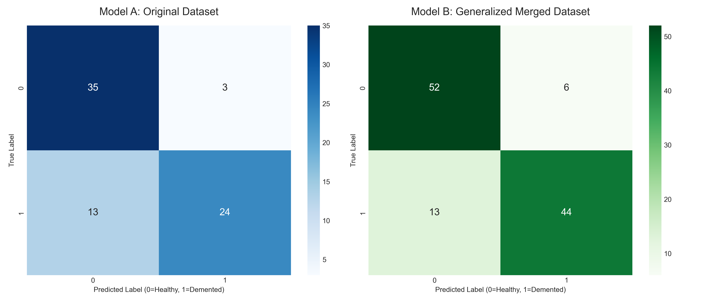
  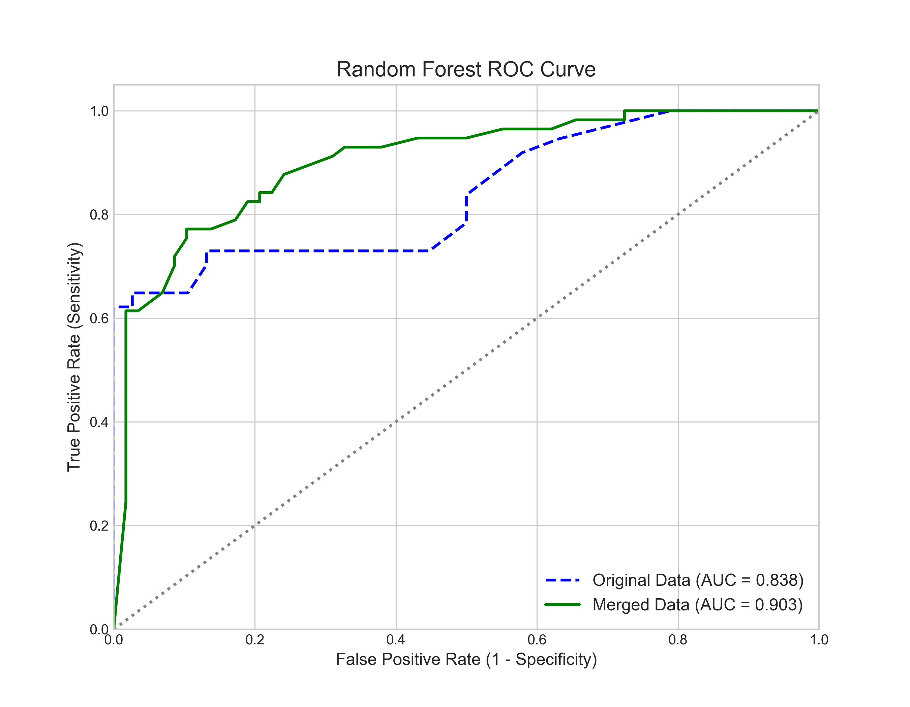
  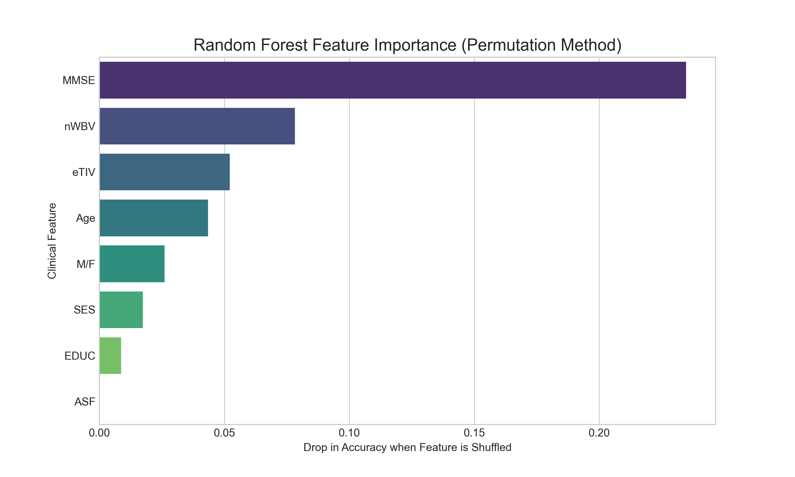
  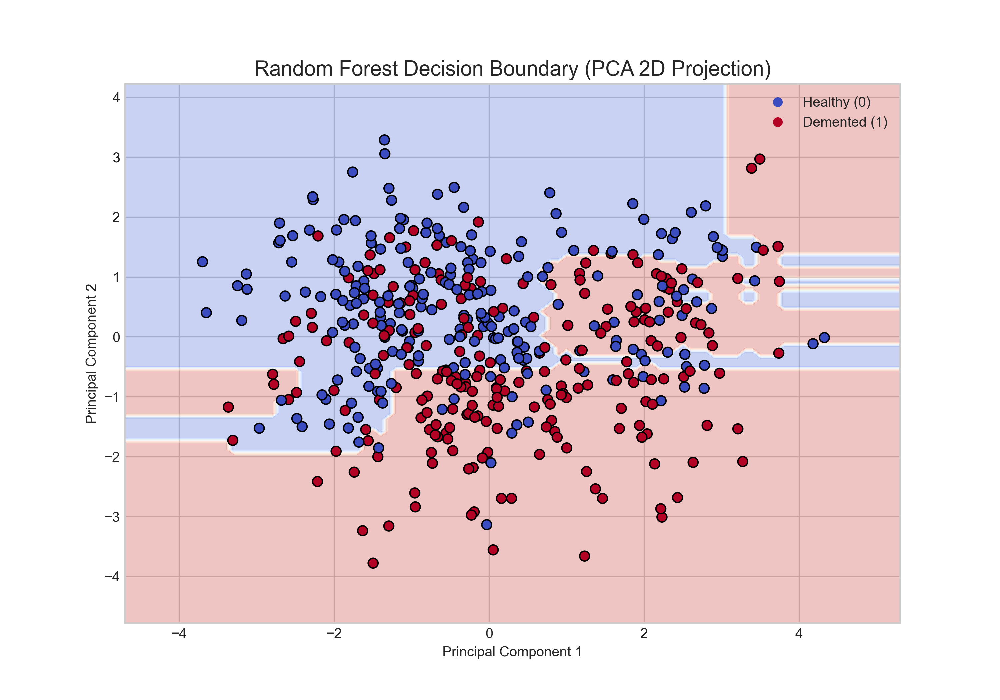
</div>

### 2. Logistic Regression
The linear probability model drew a smooth sigmoidal gradient across the data space, also independently verifying that cognitive scores and brain volume are the most heavily weighted predictive features.

<div align="center">
  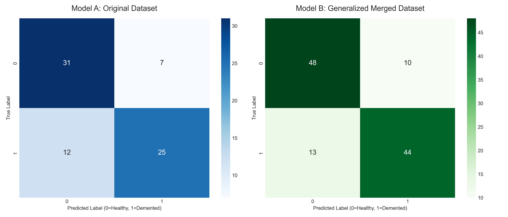
  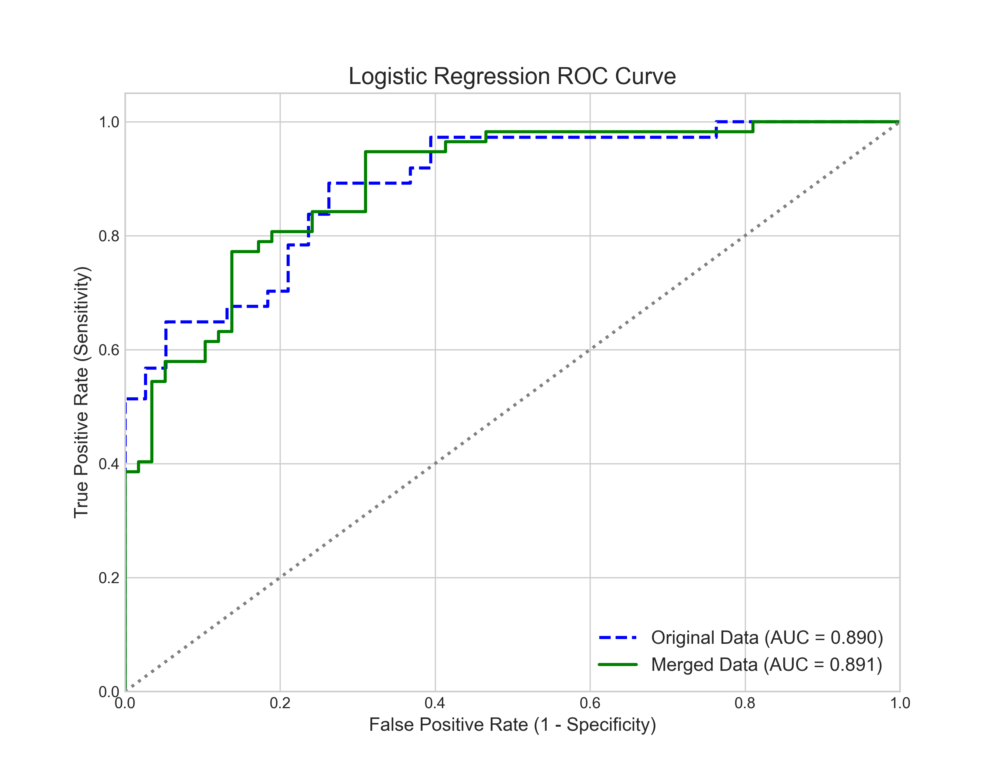
  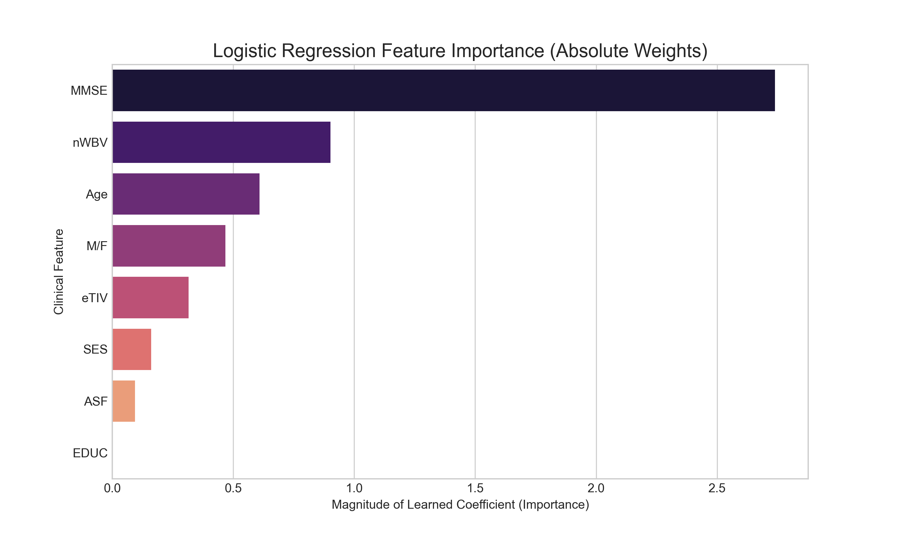
  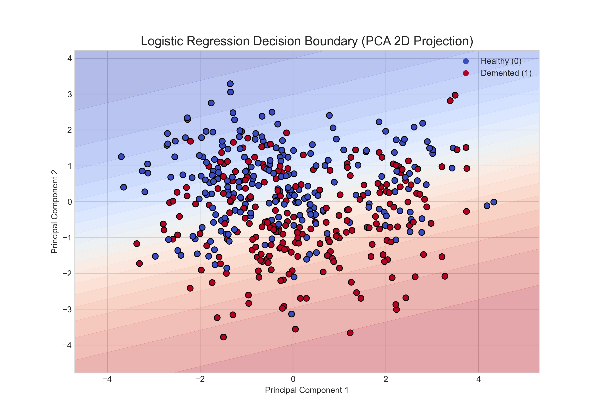
</div>

### 3. Linear Support Vector Machine
The margin-maximization math successfully drew a stark hyperplane between the clinical classes, utilizing distance to the margin as a confidence metric for the ROC curve.

<div align="center">
  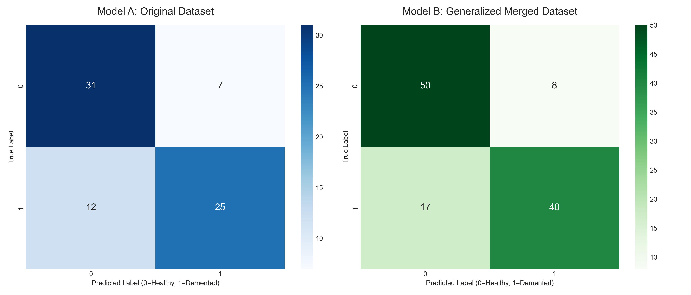
  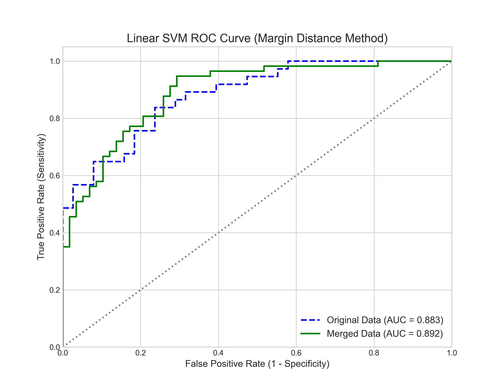
  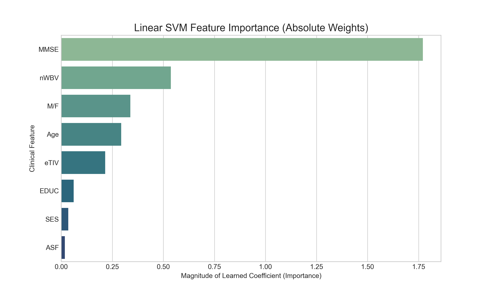
  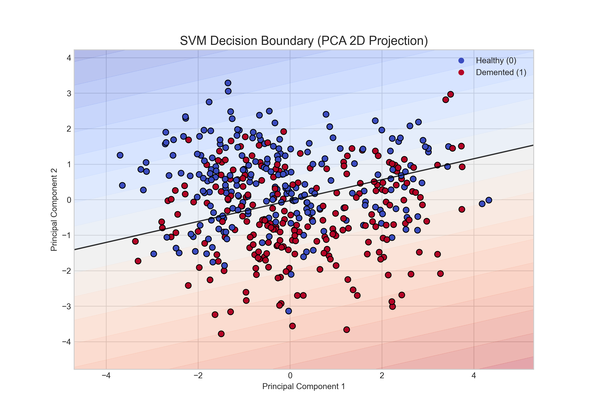
</div>

---

## 📁 Repository Structure
```text
├── dataset/
│   ├── raw/                      # Original OASIS CSV files
│   ├── processed/                # Initially processed longitudinal data
│   └── processed_merged/         # Final generalized, leak-free data
├── documentation/
│   └── Phase III Final Report.pdf # Comprehensive LaTeX academic report
├── figures/                      # 12 algorithm plots + MRI scans
├── models/                       # Saved .joblib weights for all models
├── notebooks/
│   ├── data_preprocessing.ipynb         
│   ├── data_preprocessing_merged.ipynb  # Contains the CDR leakage fix
│   ├── model_RandomForest.ipynb         # Custom ensemble math
│   ├── model_LogisticRegression.ipynb   # Custom log-loss gradient descent
│   └── model_SVM.ipynb                  # Custom hinge-loss optimization
└── README.md
